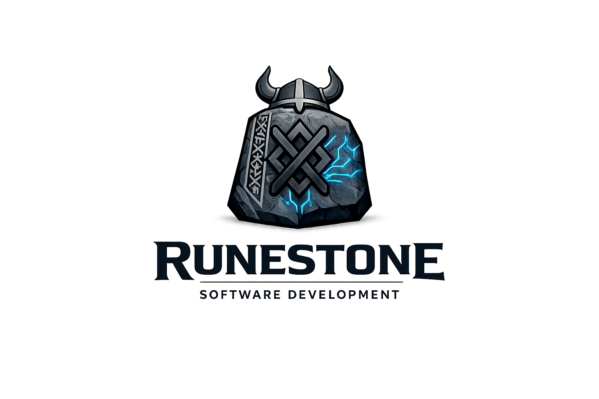

# RuneStone

  

## RuneStone Software Development

**RuneStone** is a software development organization focused on building solid, modern, and scalable technological solutions.

Our identity is inspired by **runes**—symbols of power, knowledge, and permanence—combined with a contemporary, technology-driven approach.  
We build software with strong foundations, clean design, and long-term vision.

---

## What We Do

- Custom software development  
- Modern web applications  
- Robust and scalable backend systems  
- APIs and system integrations  
- Technology consulting  

---

## Featured Projects

### Intelligent PC Component Compatibility Platform

A web-based system that automatically builds optimized computer configurations based on compatibility rules between hardware components such as CPU, GPU, motherboard, RAM, storage, and power supply.

The platform evaluates technical constraints including socket compatibility, chipset support, RAM type and frequency, power consumption, PCIe generation, and physical form factors. The backend implements a compatibility and scoring algorithm that analyzes relationships between components, calculates a global compatibility score, and applies mandatory constraints (for example, matching CPU socket with motherboard socket, ensuring sufficient PSU wattage for GPU consumption, and verifying RAM support by the motherboard).

Beyond basic validation, the system optimizes configurations according to selected goals such as gaming performance, workstation efficiency, budget limits, or energy consumption. It ensures balanced builds by preventing bottlenecks (e.g., high-end GPU paired with low-end CPU).

---

### Intelligent Academic Performance Dashboard

A web-based platform designed to analyze students’ academic performance and support informed decision-making.  

The system processes grades, identifies critical subjects, and provides a simple prediction of academic risk. The backend calculates weighted averages, applies a basic regression model to estimate performance trends, and generates automatic alerts when risk thresholds are detected.  

The frontend includes an interactive dashboard with visual charts, a risk-level indicator system, and exportable reports. This project functions as a decision-support tool focused on early detection and academic improvement.

---

### Gym Companion App with Levels, Predefined Avatars, and Personalized AI Chatbot

This project is a mobile and web-based application designed to enhance the fitness experience through workout tracking, nutrition guidance, and gamification. 

Users select **predefined avatars provided by the platform** and progress through **levels or rankings** based on completed workouts, adherence to routines, and achievements. The platform offers **personalized workout routines and diet plans**, tailored to each user’s goals, fitness level, and preferences. Additionally, an **AI-powered chatbot** provides real-time guidance, answers questions about exercises and nutrition, and motivates users to stay consistent. 

This system encourages engagement, promotes healthy habits, and transforms fitness into an interactive and rewarding experience.

---

## Vision

To be recognized as a reliable and solid software development organization, known for the quality and durability of its technological solutions.

---

## Mission

To create efficient, clean, and well-structured software that drives real-world projects forward while maintaining high technical and professional standards.

---

## Core Values

- Strength  
- Innovation  
- Clarity  
- Commitment  
- Teamwork  

---

> **RuneStone** — Software carved in stone, written in code.
